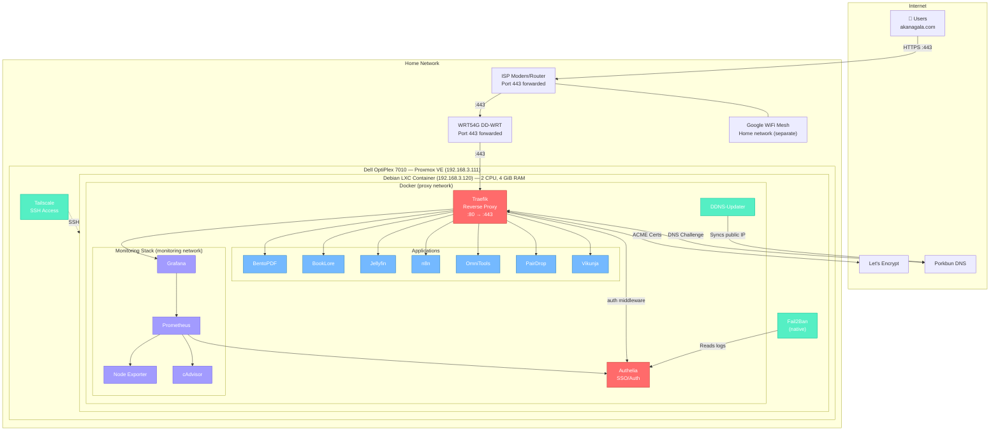

# Welcome

This project started back in September/October 2025 when I wanted to merge some PDFs together. I didn't like Mac's built-in tool, so I used a random web-based merger.

I knew no one cared about my Econometrics PSET, but I did think about the privacy concerns while I was uploading. And then I went down the self-hosting rabbit hole. During winter break of 2025-26, I first built a web server for my self hosting needs using an old OptiPlex 7010. It was glorious while it lasted, but not a week after returning to campus, the hard drive failed. Before I set up backups...

And now here we are.

This is my second attempt at building a personal web server for the sake of self-hosting a number of useful applications/services, as opposed to using a cloud-based option and giving out my data. This time, everything is backed up. This repo serves as documentation for myself and a way for anyone else who is interested in recreating my setup.

# Toplogy

## Long Term Goals

* Set up a media stack: *arr stack + buy a NAS (expensive‼️)
    * I would like to collect some Linux ISOs...
* Spin up an LXC to mess around with local LLMs
    * GPU prices... 🫤
* Maybe switch to Nginx as my reverse proxy instead of Traefik. Unsure about this one because there is no need to overcomplicate my setup.

# Understanding this Repository

The vast majority of my services run in containers on Docker. To spin them up, I use Docker Compose and docker-compose.yaml files. I have chosen to give each service its own docker-compose.yaml file to make it easy to spin up and kill individual services as necessary. Each service that runs in docker gets its own subdirectory with a docker-compose.yml and any other necessary items.

### Docker Services:

* [Traefik](/traefik/README.md): Reverse Proxy that allows you to only expose one port to the internet. Handles all routing on the server.
* [Authelia](/authelia/README.md): Handles authentication for services that are private and not meant to be access by the whole internet
* [Vikunja](/vikunja/README.md): All-in-one ToDo List, Planner, etc
* [PairDrop](/pairdrop/README.md): Local file sharing. I might drop this one because Google is now supporting AirDrop on Android phones.
* [BentoPDF](/bentopdf/README.md): PDF Tools! The reason this entire project started.
* [BookLore](/booklore/README.md): E-Book reader/storage/archiver
* [Jellyfin](/jellyfin/README.md): 
* [OmniTools](/omnitools/README.md):
* [n8n](/n8n/README.md): Automation
* [Prometheus + Grafana](/monitoring/README.md): Visualizing data

### Non-Docker Services

* [Fail2Ban](FAIL2BAN.md): Works with Authelia to prevent brute-force attacks and unauthorized access.

# AI Use

Claude Code was incredibly helpful the first time I pieced my server together.
